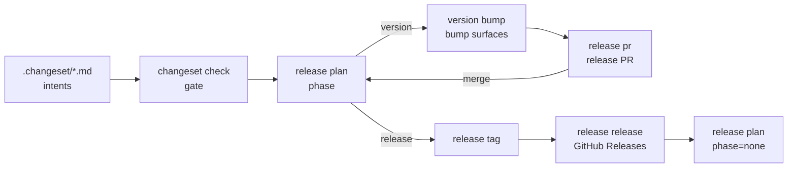

# pnpm-release-management

Release tooling for our pnpm monorepos — the lifecycle apps, the reusable GitHub
workflows that call them, and the containerised end-to-end test that proves the
whole pipeline. It replaces the four near-identical private copies of these
tools that had drifted apart in `systemfsoftware`, `omp-claude-compat` and
`comment-checker`.

A consuming repository keeps its `release.jsonc`, its `.changeset/` intents and
its manifests, and deletes its own copies of the tools.

## Layout

One app per capability of the release lifecycle. Each app is a single
`effect/unstable/cli` program (Effect 4's CLI module) whose subcommands are the
steps of that capability.

```
apps/
  changeset-management/       changeset new | check
  version-management/         version bump | sync | sync-root
  github-release-management/  release plan | pr | tag | release
  git-hooks/                  hooks pre-commit | commit-msg
packages/*/                   the libraries every app imports by name
apps/*/dist/main.js           the tsdown bundles the workflows and the e2e image run
e2e/                          the containerised pipeline test (vitest)
```

Apps are Node programs built with tsdown into self-contained ESM bundles, then
compiled with `deno compile` into one binary each. The flake exports them, and
`packages.<system>.release-tools` joins the three release apps. A repository
takes this flake as an input, pinned by its `flake.lock`, and puts
`release-tools` in its dev shell, so a workflow runs the locked revision without
installing anything:

```bash
nix develop --command github-release-management plan \
  --tarballs "$(nix build --no-link --print-out-paths .#workspace-tarballs)" \
  --output "$GITHUB_OUTPUT"
```

Each app is a composition root: `main.ts` declares the `Flag`/`Argument`
surface and holds the one `NodeRuntime.runMain` edge, `boundary.ts` decodes the
invocation into the cell's request, and `render.ts` turns the decision or the
refusal into the lines that go out. A refusal surfaces as a `::error::`
workflow annotation and exit 1.

## What it does

The pipeline has one job: turn authored change intents into versioned, tagged
packages and GitHub Releases without a human deciding _when_ anything runs. Every
phase is derived from durable repository state, never from a pull-request ref,
so a half-finished release resumes on the next push.



`version bump` also writes the per-package changelog that later becomes the
GitHub Release body, which is why the order matters: the release notes are
authored with the version bump, not reconstructed at release time.

Nothing is published to a registry. Consumers take a package from the
repository's own Nix flake at a tag or revision.

## Quick start

Add a caller to the consuming repository. The trigger and the permissions stay
with you; the phase decision stays in the reusable workflow.

`.github/workflows/release.yml`:

```yaml
name: Release

on:
  push:
    branches: [main]

permissions:
  contents: write
  pull-requests: write

jobs:
  release:
    uses: systemfsoftware/pnpm-release-management/.github/workflows/release.yml@main
```

`.github/workflows/changeset-check.yml`:

```yaml
name: Changeset Check

on:
  pull_request:
    types: [opened, synchronize, reopened, ready_for_review]

permissions:
  contents: read
  pull-requests: read

jobs:
  check:
    uses: systemfsoftware/pnpm-release-management/.github/workflows/changeset-check.yml@main
```

Then add a `release.jsonc`:

```jsonc
{
  "base": "main",
  "branch": "changeset-release/main",
  "versioning": {
    "strategy": "surfaces",
    "manifest": "package.json",
    "changelog": "CHANGELOG.md",
    "surfaces": [
      { "kind": "toml", "header": "[workspace.package]", "glob": "crates/*/Cargo.toml" },
      { "kind": "nix", "path": "nix/version.nix" }
    ]
  },
  "gate": { "strategy": "turbo", "task": "build" },
  "pr": { "title": "chore(release): version packages" }
}
```

## Configuration

`release.jsonc` at the repository root. Every path is relative to the root.

| Key                             | Default                     | Meaning                                                          |
| ------------------------------- | --------------------------- | ---------------------------------------------------------------- |
| `base`                          | required                    | branch the release PR targets                                    |
| `branch`                        | required                    | branch the release PR is opened from                             |
| `changesetDir`                  | `.changeset`                | where pending intents live                                       |
| `changelogDir`                  | `<changesetDir>/changelogs` | where generated per-package changelogs are written               |
| `versioning.strategy`           | required                    | `surfaces` or `changesets`                                       |
| `versioning.manifest`           | —                           | `surfaces`: the JSON manifest that owns the version              |
| `versioning.changelog`          | —                           | `surfaces`: the root changelog that receives the release summary |
| `versioning.surfaces[]`         | —                           | `surfaces`: additional files rewritten on every bump             |
| `gate.strategy`                 | required                    | `turbo` (a task graph decides what a change touches) or `paths`  |
| `gate.task`                     | `build`                     | `turbo`: the task whose inputs decide the changed packages       |
| `distribution.launcherManifest` | —                           | required only for repositories that ship platform packages       |
| `distribution.targets[]`        | —                           | `{ target, suffix, os, cpu, libc?, runner, bin }`                |
| `pr.title` / `pr.body`          | built-in copy               | release PR copy                                                  |

A surface is one of:

| `kind`  | Fields                                                          | Example           |
| ------- | --------------------------------------------------------------- | ----------------- |
| `json`  | `path`                                                          | `package.json`    |
| `toml`  | `path` or `glob`, `header` (`[package]`, `[workspace.package]`) | `Cargo.toml`      |
| `cargo` | `path`, optional `package`                                      | `Cargo.toml`      |
| `nix`   | `path`                                                          | `nix/version.nix` |

`surfaces` versioning bumps the manifest, rewrites the version in every declared
surface, and appends the release summary to the root changelog. `changesets`
versioning drives the changesets libraries per package: the assembled release
plan decides each member's bump, workspace dependents move with it, and the
consumed intents are removed.

A `cargo` surface rewrites `[workspace.package] version` in the named manifest,
any workspace member that pins a literal `[package] version`, and every
workspace-member entry in the sibling `Cargo.lock` (registry and git
dependencies carry a `source` line and are left alone). Its optional `package`
names the workspace package whose bumped version the Cargo workspace follows;
it is required under `changesets` versioning, where there is no single version.

A `cargo` surface rewrites `[workspace.package] version` in the named manifest,
any workspace member that pins a literal `[package] version`, and every
workspace-member entry in the sibling `Cargo.lock` (registry and git
dependencies carry a `source` line and are left alone). Its optional `package`
names the workspace package whose bumped version the Cargo workspace follows;
it is required under `pnpm` versioning, where there is no single version.

## Change intents

An intent is a Markdown file in `.changeset/` whose frontmatter names the
packages it changes and with which bump, and whose body is the release note.

```markdown
---
"@scope/alpha": minor
"@scope/beta": none
---

Alpha grows a public export.
```

Author one with `changeset new` rather than by hand:

```bash
node apps/changeset-management/dist/main.js new @scope/alpha --bump minor \
  --summary "Alpha grows a public export"
```

`none` consumes an intent without moving a version — use it for work that must
be recorded but does not ship. `version bump` deletes every intent it consumes,
so the release PR diff _is_ the set of notes that shipped.

## Capabilities

| App subcommand      | What it does                                                             |
| ------------------- | ------------------------------------------------------------------------ |
| `changeset check`   | Fails when a publishable package changed without an intent naming it     |
| `changeset new`     | Writes an intent file                                                    |
| `version bump`      | Consumes intents, bumps every surface, writes per-package changelogs     |
| `version sync`      | `check` or `bump <version>` across every declared surface                |
| `version sync-root` | Stamps the launcher manifest with the released version                   |
| `release pr`        | Commits the release branch, opens, refreshes, or closes the release PR   |
| `release plan`      | Derives the release phase from repository state                          |
| `release tag`       | Captures the cycle, then pushes one tag per released package             |
| `release release`   | Creates GitHub Releases from the generated changelogs                    |
| `hooks pre-commit`  | Formats and checks the staged set before a commit lands                  |
| `hooks commit-msg`  | Enforces the conventional-commit header and strips AI co-author trailers |

Every subcommand takes `--config <path>` and otherwise loads `release.jsonc` from
the directory it is run in. The flag may name either the workspace root or a file
inside it: a directory is taken as the root, a file path means its directory is.

Flags worth knowing:

| App subcommand      | Flags                                                                                         |
| ------------------- | --------------------------------------------------------------------------------------------- |
| `changeset check`   | `<base-sha-or-ref>`, `--base`, `--skip-liveness`                                              |
| `release plan`      | `--output <file>`, `--deferred <file>`, `--remote <name>`                                     |
| `release tag`       | `--captured <file>`, `--output <file>`, `--exclude`, `--json`, `--dry-run`, `--remote <name>` |
| `release release`   | `--captured <file>`, `--assert`, `--dry-run`                                                  |
| `version sync`      | `check \| bump <version>`                                                                     |
| `version sync-root` | `--manifest <path>`, `--version <version>`, `--dry-run`                                       |

`--output` on `release tag` captures the cycle _and_ skips pushing: the workflow
captures once, then hands the same file to tagging and the release step so both
agree on what this cycle owns.

## CI

| Workflow              | Inputs                                    | Caller must grant                                           |
| --------------------- | ----------------------------------------- | ----------------------------------------------------------- |
| `release.yml`         | `ci-workflow` (required), `artifacts-dir` | `contents: write`, `pull-requests: write`, `actions: write` |
| `changeset-check.yml` | `base-sha`                                | `contents: read`                                            |

A pull request opened with the workflow token starts no workflows, so after
opening or updating the release PR, `release.yml` dispatches the caller's CI
workflow (`ci-workflow`, which must accept `workflow_dispatch`) on the release
branch. That gives the release PR the checks the branch protection requires.

Both workflows run the apps from the caller's dev shell (`nix develop`). The
revision is the one the caller's `flake.lock` pins for its
`pnpm-release-management` input; `nix flake update pnpm-release-management`
moves it. The caller's `devShells.<system>.default` must provide
`release-tools`, pnpm, the `sandbox` and `SANDBOX_PNPM_STORE` (see
[Distribution through Nix](#distribution-through-nix)). `changeset-check.yml`
runs turbo, which is the caller's dependency code, so its install and the gate
both run inside `sandbox`, offline from the Nix-built pnpm store. Neither
workflow installs packages from a registry.

## Distribution through Nix

A repository ships its public workspace packages as flake outputs. Nothing goes
to a registry. One call in `flake.nix`:

```nix
packages = forEachSystem (pkgs:
  pnpm-release-management.lib.mkPnpmWorkspacePackages {
    inherit pkgs;
    src = self;
    hash = "sha256-…"; # third-party dependencies, keyed by pnpm-lock.yaml
  });
```

For every member of `pnpm-workspace.yaml` that is not `private`, this gives
`packages.<system>.<name>`: the member's `pnpm pack` tarball, with the scope
dropped from the name. It also gives `packages.<system>.workspace-tarballs`:
every tarball plus an `index.json` of `{ name, file }`.

- Third-party dependencies enter only through nixpkgs' `fetchPnpmDeps`
  (`fetcherVersion = 4`): a fixed-output derivation pinned by `hash`. A changed
  lockfile changes the hash, and the build fails until it is updated. The build
  itself never reaches a registry.
- Install runs with `--ignore-scripts` in the Nix sandbox. The members build
  with their `build` script (`buildScript` overrides it), then `pnpm pack`
  writes each tarball and turns every `workspace:` range into the exact version.
- The tarballs rebuild bit-for-bit. CI proves it with
  `nix build --rebuild .#workspace-tarballs`. A declaration file that prints an
  inferred union breaks this, because TypeScript 7 orders union members
  differently from run to run (microsoft/TypeScript#64589). Annotate such an
  export with a named type.
- `pnpm` defaults to `pkgs.pnpm_12`. The root `packageManager` must pin exactly
  that version, or evaluation fails: one pnpm resolves everywhere.
- `packages.<system>.pnpm-store` is the same fixed-output dependency set,
  unpacked into a store directory pnpm can install from offline.

A consumer takes the flake as an input pinned by `flake.lock`. A pull
request's head revision is a snapshot, and a release tag is a stable version.
It builds the tarballs it needs and depends on them with `file:` paths, so each
tarball's integrity lands in the consumer's `pnpm-lock.yaml`.

## Release identity

A released `name@version` is immutable. The tarball a consumer downloads once is
the tarball every consumer downloads forever, so the integrity its lockfile
records for that `name@version` can never change. Nothing pushes to a registry,
so a rebuilt tarball at a later revision is the only way the bytes could drift,
and that is exactly what the release tooling refuses.

`release tag` records the identity when it releases. It creates an annotated tag
`<name>@v<version>` whose message is JSON:

```json
{
  "integrity": "sha512-<base64 of the .tgz bytes>",
  "files": { "package/package.json": "sha512-<base64>", "package/index.js": "sha512-<base64>" }
}
```

`--tarballs <dir>` is required on both `release plan` and `release tag`; it names
a directory of `*.tgz` (the `packages.<system>.workspace-tarballs` output, or
`pnpm -r pack --pack-destination <dir>`). A tarball's name and version come from
its own `package/package.json`, never from its filename, so a Nix output and a
`pnpm pack` output are interchangeable.

`release plan` checks identity before it plans anything else. For every member
whose current `name@version` already has a tag on the remote — except members
the pending changesets plan will move to a new version — it fetches the tag
object, recomputes `{ integrity, files }` from the tarball in `--tarballs`,
and compares. A mismatch fails the plan red, naming `package@version`, the
recorded and current hashes, and the first differing file in sorted path order.
A file present on only one side counts as differing, so a changed dependency
range surfaces as `package/package.json`. A lightweight tag or an annotation the
tool cannot parse is refused too; a release tag is never silently skipped.

Dependents always bump so the check can hold. A bare `workspace:^` packs as
`^<current version>` of the dependency, so bumping a dependency changes the
dependent's packed bytes even when its own source did not move. With
`updateInternalDependents: 'always'` (plus `updateInternalDependencies: 'patch'`),
a minor intent on one member moves every workspace dependent by a patch release,
which keeps each dependent's own `name@version` identity intact instead of
rewriting an already-released tarball.

## Sandbox

`packages.<system>.sandbox` runs dependency code with nothing it was not given:

```bash
sandbox -- pnpm install
sandbox -- pnpm build
sandbox -- pnpm test
sandbox --allow-host api.cloudflare.com --pass-env CLOUDFLARE_API_TOKEN -- pnpm deploy
```

pnpm never reaches a registry from the sandbox. `--pnpm-store` (the dev shell
sets `SANDBOX_PNPM_STORE` to `packages.<system>.pnpm-store`) points pnpm at the
Nix-built store. The sandbox then runs pnpm with `offline`, `frozen-lockfile`,
`ignore-scripts` and `trust-lockfile`; the fixed-output fetch already checked
the lockfile. Each invocation gets a private copy of the store's index database
that is discarded at exit, so the Nix store stays read-only. `$HOME` is a fresh
tmpfs every time, so nothing a dependency plants survives. Tool caches that
should persist (turbo, vite, `tsbuildinfo`) belong in the project's gitignored
`.cache/`; the sandbox sets `XDG_CACHE_HOME` to it.

| Boundary    | Inside the sandbox                                                                                                                                                               |
| ----------- | -------------------------------------------------------------------------------------------------------------------------------------------------------------------------------- |
| filesystem  | the project directory read-write, only the invoking closure's store paths readable (`/nix/store` is not listable), an empty `$HOME`, a private `/tmp`; no other home directories |
| environment | cleared, then `PATH`, `TERM`, locale, `TZ`, `CI` and colour settings, plus each `--pass-env`                                                                                     |
| network     | loopback only; each `--allow-host` opens HTTPS to that host through an allow-list proxy; only `--publish` ports reach the host                                                   |
| processes   | own PID, IPC and UTS namespaces, no capabilities, killed with its parent, no controlling terminal                                                                                |

It is bubblewrap (`--unshare-all`, `--cap-drop ALL`, `--die-with-parent`,
`--new-session`) and runs on Linux only. Egress goes through a CONNECT proxy
outside the sandbox that tunnels only to declared `host[:port]` (default 443;
`*.example.com` matches subdomains). Inside, `HTTPS_PROXY` points at it and
`NODE_USE_ENV_PROXY=1` makes Node's `fetch` use it. There is no unsandboxed
mode.

Reads of `/nix/store` are restricted to the invocation's closure: the launcher
resolves `nix-store --query --requisites` over the sandboxed `PATH`, the command
and its own helpers, then mounts each of those paths read-only over an empty
`/nix/store` that cannot be listed. A store path outside the closure is
unreadable, so a dependency cannot enumerate or reach the rest of the store.

`--egress-log PATH` appends one JSONL line per proxy decision, allowed or
refused, at least `{"host","port","decision","rule"}`. The file must sit outside
the sandbox's writable tree — the project, its `$HOME` and its `/tmp` — and the
launcher refuses `PATH` inside them with exit code 2. With `--egress-log` set the
proxy runs and the proxy environment is set even without `--allow-host`, so
refusals are logged too.

`--publish HOST_PORT:SANDBOX_PORT` makes a sandbox port reachable as
`127.0.0.1:HOST_PORT` on the host; only published ports are reachable. On Linux
the sandbox has its own network namespace, so an outside forwarder bridges the
host port to an inside forwarder over a Unix socket. `--listen PORT` declares a
port the stack may bind without publishing it. Both flags take ports 1–65535;
anything malformed exits 2 with usage.

`packages.<system>.sandbox-proofs` is the gate. Each refusal proof first prints
from inside the same sandbox, so a sandbox that fails to start fails the proof
instead of passing it. The proofs: reading `~/.ssh` and `~/.config` fails,
writing outside the project fails, a write to the real `/tmp` leaves nothing on
the host, agent sockets and secrets do not cross the cleared environment, a
store path outside the closure and the listing of `/nix/store` both fail while a
closure tool still runs and an offline `pnpm` 12 install of a tiny workspace
resolves from the `--pnpm-store` store, `--egress-log` records exactly the
allowed and refused decisions and refuses a log inside the project, an
undeclared connection fails, a declared host is reachable while every other host
is refused, a loopback dev server still answers, and a published port answers
from the host while an unpublished one does not. CI runs them on Linux, then
installs, builds and tests this repository as three separate sandbox
invocations with no network at all.

bubblewrap needs unprivileged user namespaces and a mountable `/proc`. Ubuntu
24.04 needs `sysctl kernel.apparmor_restrict_unprivileged_userns=0`. A
container needs `/proc` unmasked (`--security-opt unmask=/proc/*` under
podman). Without them the sandbox refuses to start.

## Install, build, test, package

Enter the dev shell (`direnv allow`, or `nix develop`) for node, pnpm and
deno, then:

| Command             | What it runs                                             |
| ------------------- | -------------------------------------------------------- |
| `pnpm install`      | install the workspace (`--frozen-lockfile` in CI)        |
| `pnpm build`        | turbo: tsdown bundles every package and app              |
| `pnpm typecheck`    | turbo: `tsc --noEmit` over every package and app         |
| `pnpm lint`         | turbo: oxlint with the strict preset over the whole tree |
| `pnpm format:check` | `dprint check`                                           |
| `pnpm test`         | turbo: the vitest suites                                 |
| `pnpm check:ci`     | all of the above, the same gate CI runs                  |

Each app builds to a self-contained ESM bundle at
`apps/<app>/dist/main.js` (npm dependencies inlined, so nothing resolves at
ship time). Packaging wraps that bundle with `deno compile`:

```bash
deno compile --allow-read --allow-write --allow-run --allow-env --allow-net --allow-sys \
  --output dist/<app> dist/main.js
```

`nix build` produces the same binaries; Deno is the packager here, never the
runtime. Run an app from its bundle or its binary:

```bash
node apps/changeset-management/dist/main.js --help
./apps/changeset-management/dist/changeset-management --help
```

## End-to-end test

`pnpm --filter @systemfsoftware/e2e test` builds one container and drives the
entire pipeline in it: a two-package pnpm workspace, a bare git origin and a
GitHub API mock. The phases run in order under vitest and each one's failure
names itself.

The image builds the workspace with pnpm (`pnpm install --frozen-lockfile`,
`pnpm build`, then the `package` task that runs `deno compile` over each
bundle) and ships the four app binaries at `/opt/prm/<app>`. The phases drive
those binaries, never app source, so the test proves what actually ships.

What the container proves is broader than the apps. `git`, `pnpm` and `node`
are the real binaries; the workspace is a real pnpm workspace with a real
lockfile; the release PR, tags and Releases go through real git and a real
HTTP API surface.

The container is hermetic without weakening the apps. `api.github.com` is
redirected to `127.0.0.1` inside the container by
`withExtraHosts`, and a TLS front door on port 443 (plain Node, no runtime
grants to widen) terminates a certificate signed by a CA the image installs
into the system trust store. The apps therefore talk to their production URLs
with no `localhost` behaviour anywhere: no app carries a test-only host, and
no test-only base URL exists to forget to remove.

`registry.npmjs.org` is redirected the same way, but nothing publishes there:
verdaccio stands behind it as a tripwire. It keeps `publish: $all`, so a
regression that publishes succeeds at the registry instead of hiding behind an
auth error, and it writes every request to `/tmp/verdaccio/verdaccio.log`. The
last phase, `the release never publishes to npm`, sends one `GET /-/ping` and
waits for it in that log, so a tripwire that logs nothing cannot pass. It then
asserts zero `PUT` requests in the log and no package under verdaccio's storage.

Green and red runs alike leave a transcript under `e2e/.artifacts/<timestamp>/`:

| Artifact         | Contents                                    |
| ---------------- | ------------------------------------------- |
| `transcript.log` | every command, exit code, output and timing |
| `commands.jsonl` | the same records, machine readable          |
| `summary.json`   | phase names, statuses and timings           |

```bash
E2E_FILTER='tagging pushes' pnpm --filter @systemfsoftware/e2e test   # run only matching phases
E2E_KEEP=1 pnpm --filter @systemfsoftware/e2e test                  # leave the container up and print its id
```

## Contributing

Development setup, hooks and the release workflow for this repository itself:
[CONTRIBUTING.md](CONTRIBUTING.md).

## License

Apache-2.0. See [LICENSE](LICENSE).
