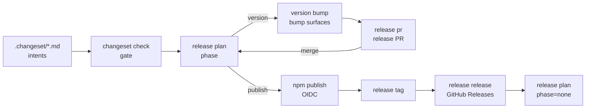

# pnpm-release-management

Release tooling for our pnpm monorepos — the lifecycle apps, the reusable GitHub
workflows that call them, and the containerised end-to-end test that proves the
whole pipeline. It replaces the four near-identical private copies of these
tools that had drifted apart in `systemfsoftware`, `omp-claude-compat` and
`comment-checker`.

A consuming repository keeps its `release.jsonc`, its `.changeset/` intents and
its manifests, and deletes its own copies of the tools.

## Layout

One app per capability of the release lifecycle. Each app is a single
`effect/unstable/cli` program (Effect 4's CLI module) whose subcommands are the
steps of that capability.

```
apps/
  changeset-management/       changeset new | check
  version-management/         version bump | sync | sync-root
  npm-publish-management/     npm publish | status | trust
  github-release-management/  release plan | pr | tag | release
  git-hooks/                  hooks pre-commit | commit-msg
packages/release-shared/      the shared library every app imports by name
e2e/                          the containerised pipeline test
```

Apps are Deno executables with the permissions they need in their shebang, so a
workflow runs one directly:

```bash
./release-tools/apps/github-release-management/main.ts plan --output "$GITHUB_OUTPUT"
```

Subcommands are declared with `Flag`/`Argument`, handlers return an
`Effect` whose failure channel is `ToolError`, and `main.ts` holds the one
`DenoRuntime.runMain` edge. A `ToolError` surfaces as a `::error::` workflow
annotation and a non-zero exit; a refusal that has already explained itself on
stderr just exits non-zero.

## What it does

The pipeline has one job: turn authored change intents into published packages,
tags and GitHub Releases without a human deciding _when_ anything runs. Every
phase is derived from durable repository state, never from a pull-request ref,
so a half-finished release resumes on the next push.



`version bump` also writes the per-package changelog that later becomes the
GitHub Release body, which is why the order matters: the release notes are
authored with the version bump, not reconstructed at publish time.

## Quick start

Add a caller to the consuming repository. The trigger and the permissions stay
with you; the phase decision stays in the reusable workflow.

`.github/workflows/release.yml`:

```yaml
name: Release

on:
  push:
    branches: [main]

permissions:
  contents: write
  pull-requests: write
  id-token: write

jobs:
  release:
    uses: systemfsoftware/pnpm-release-management/.github/workflows/release.yml@main
```

`.github/workflows/changeset-check.yml`:

```yaml
name: Changeset Check

on:
  pull_request:
    types: [opened, synchronize, reopened, ready_for_review]

permissions:
  contents: read
  pull-requests: read

jobs:
  check:
    uses: systemfsoftware/pnpm-release-management/.github/workflows/changeset-check.yml@main
```

Then add a `release.jsonc`:

```jsonc
{
  "base": "main",
  "branch": "changeset-release/main",
  "versioning": {
    "strategy": "surfaces",
    "manifest": "package.json",
    "changelog": "CHANGELOG.md",
    "surfaces": [
      { "kind": "toml", "header": "[workspace.package]", "glob": "crates/*/Cargo.toml" },
      { "kind": "nix", "path": "nix/version.nix" }
    ]
  },
  "gate": { "strategy": "turbo", "task": "build" },
  "pr": { "title": "chore(release): version packages" },
  "provenance": true
}
```

## Configuration

`release.jsonc` at the repository root. Every path is relative to the root.

| Key                             | Default                      | Meaning                                                          |
| ------------------------------- | ---------------------------- | ---------------------------------------------------------------- |
| `base`                          | required                     | branch the release PR targets                                    |
| `branch`                        | required                     | branch the release PR is opened from                             |
| `changesetDir`                  | `.changeset`                 | where pending intents live                                       |
| `changelogDir`                  | `<changesetDir>/changelogs`  | where generated per-package changelogs are written               |
| `versioning.strategy`           | required                     | `surfaces` or `pnpm`                                             |
| `versioning.manifest`           | —                            | `surfaces`: the JSON manifest that owns the version              |
| `versioning.changelog`          | —                            | `surfaces`: the root changelog that receives the release summary |
| `versioning.surfaces[]`         | —                            | `surfaces`: additional files rewritten on every bump             |
| `gate.strategy`                 | required                     | `turbo` (a task graph decides what a change touches) or `paths`  |
| `gate.task`                     | `build`                      | `turbo`: the task whose inputs decide the changed packages       |
| `distribution.launcherManifest` | —                            | required only for repositories that ship platform packages       |
| `distribution.targets[]`        | —                            | `{ target, suffix, os, cpu, libc?, runner, bin }`                |
| `pr.title` / `pr.body`          | built-in copy                | release PR copy                                                  |
| `publishArgs`                   | `[]`                         | extra arguments appended to `pnpm publish -r`                    |
| `provenance`                    | `true`                       | publish with `--provenance`                                      |
| `registry`                      | `https://registry.npmjs.org` | registry to publish to and query                                 |

A surface is one of:

| `kind` | Fields                                                          | Example           |
| ------ | --------------------------------------------------------------- | ----------------- |
| `json` | `path`                                                          | `package.json`    |
| `toml` | `path` or `glob`, `header` (`[package]`, `[workspace.package]`) | `Cargo.toml`      |
| `nix`  | `path`                                                          | `nix/version.nix` |

`surfaces` versioning bumps the manifest, rewrites the version in every declared
surface, and appends the release summary to the root changelog. `pnpm`
versioning delegates to `pnpm version -r`.

## Change intents

An intent is a Markdown file in `.changeset/` whose frontmatter names the
packages it changes and with which bump, and whose body is the release note.

```markdown
---
"@scope/alpha": minor
"@scope/beta": none
---

Alpha grows a public export.
```

Author one with `changeset new` rather than by hand:

```bash
apps/changeset-management/main.ts new @scope/alpha --bump minor \
  --summary "Alpha grows a public export"
```

`none` consumes an intent without moving a version — use it for work that must
be recorded but does not ship. `version bump` deletes every intent it consumes,
so the release PR diff _is_ the set of notes that shipped.

## Capabilities

| App subcommand      | What it does                                                                      |
| ------------------- | --------------------------------------------------------------------------------- |
| `changeset check`   | Fails when a publishable package changed without an intent naming it              |
| `changeset new`     | Writes an intent file                                                             |
| `version bump`      | Consumes intents, bumps every surface, writes per-package changelogs              |
| `version sync`      | `check` or `bump <version>` across every declared surface                         |
| `version sync-root` | Stamps the launcher manifest with the released version                            |
| `release pr`        | Commits the release branch, opens, refreshes, or closes the release PR            |
| `release plan`      | Derives the release phase from repository state                                   |
| `release tag`       | Captures the cycle, then pushes one tag per released package                      |
| `release release`   | Creates GitHub Releases from the generated changelogs                             |
| `npm publish`       | Runs `pnpm publish -r`, optionally restricted to unpublished captured versions    |
| `npm status`        | Reports each package's registry state and provenance evidence                     |
| `npm trust`         | First publish plus trusted-publisher registration, for packages OIDC cannot debut |
| `hooks pre-commit`  | Formats and checks the staged set before a commit lands                           |
| `hooks commit-msg`  | Enforces the conventional-commit header and strips AI co-author trailers          |

Every subcommand takes `--config <path>` and otherwise loads `release.jsonc` from
the repository root, which it finds through git.

Flags worth knowing:

| App subcommand      | Flags                                                                                                        |
| ------------------- | ------------------------------------------------------------------------------------------------------------ |
| `changeset check`   | `<base-sha-or-ref>`, `--base`, `--skip-liveness`                                                             |
| `release plan`      | `--output <file>`, `--deferred <file>`, `--remote <name>`                                                    |
| `release tag`       | `--captured <file>`, `--output <file>`, `--exclude`, `--json`, `--dry-run`, `--remote <name>`                |
| `release release`   | `--captured <file>`, `--assert`, `--dry-run`                                                                 |
| `npm publish`       | `--captured <file>`, `--unpublished`, `--filters <file>`, `--registry <url>`, `--no-provenance`, `--dry-run` |
| `npm status`        | `--preflight`, `--check`, `--json`, `--emit-filters <file>`, `--emit-deferred <file>`, `--registry <url>`    |
| `npm trust`         | `--only <name>`, `--jobs <n>`, `--file <list>`, `--registry <url>`, `--dry-run`                              |
| `version sync`      | `check \| bump <version>`                                                                                    |
| `version sync-root` | `--manifest <path>`, `--version <version>`, `--dry-run`                                                      |

`--output` on `release tag` captures the cycle _and_ skips pushing: the workflow
captures once, then hands the same file to publishing, tagging and the release
step so all three agree on what this cycle owns.

## CI

| Workflow              | Inputs                                                       | Caller must grant                                            |
| --------------------- | ------------------------------------------------------------ | ------------------------------------------------------------ |
| `release.yml`         | `tools-ref`, `artifacts-dir`, `node-version`, `deno-version` | `contents: write`, `pull-requests: write`, `id-token: write` |
| `changeset-check.yml` | `tools-ref`, `base-sha`, `deno-version`, `node-version`      | `contents: read`, `pull-requests: read`                      |

`tools-ref` pins the revision of this repository that a release runs from;
`@main` tracks the tip. Both workflows check this repository out into
`.release-tools` and run its apps against the caller's workspace.

The publish job needs an npm trusted publisher configured for the repository, as
`pnpm publish --provenance` is keyless OIDC. A package that has never been
published cannot be debuted by OIDC: run `npm trust` once, register its trusted
publisher, and the next push publishes it.

## Local gates

| Command            | What it runs                                                |
| ------------------ | ----------------------------------------------------------- |
| `deno task check`  | `deno check` over every app, the shared package and the e2e |
| `deno task lint`   | `deno lint` over the whole tree                             |
| `deno task format` | `dprint fmt`                                                |
| `deno task ci`     | all of the above plus the test suite                        |
| `deno task e2e`    | the containerised pipeline (see below)                      |

The repository is Deno-only: no `package.json`, no `node_modules`, no second
lockfile. `deno.json` is the single manifest, and everything — including the
pure cores' types — is checked by `deno check`.

## End-to-end test

`deno task e2e` builds one container and drives the entire pipeline in it: a
two-package pnpm workspace, a bare git origin, a GitHub API mock, and a local
registry. Fourteen phases run in order and each one's failure names itself.

What the container proves is broader than the apps. `git`, `pnpm`, `node` and
`deno` are the real binaries; the workspace is a real pnpm workspace with a real
lockfile; the release PR, tags and Releases go through real git and a real HTTP
API surface.

The container is hermetic without weakening the apps. `api.github.com` and
`registry.npmjs.org` are redirected to `127.0.0.1` inside the container by
`withExtraHosts`, and a TLS front door on port 443 terminates a certificate
signed by a CA the image installs into the system trust store. The apps
therefore run with their production permissions — `--allow-net=api.github.com`
for the GitHub apps, `--allow-net=registry.npmjs.org` for the registry apps —
and with production URLs. No app carries a `localhost` grant, and no test-only
base URL exists to forget to remove.

Green and red runs alike leave a transcript:

| Artifact         | Contents                                    |
| ---------------- | ------------------------------------------- |
| `transcript.log` | every command, exit code, output and timing |
| `commands.jsonl` | the same records, machine readable          |
| `summary.json`   | phase names, statuses and timings           |

```bash
E2E_FILTER='publish lands' deno task e2e   # run only matching phases
E2E_KEEP=1 deno task e2e                  # leave the container up and print its id
```

## Contributing

Development setup, hooks and the release workflow for this repository itself:
[CONTRIBUTING.md](CONTRIBUTING.md).

## License

Apache-2.0. See [LICENSE](LICENSE).
