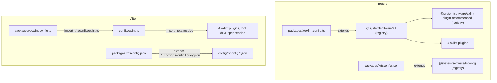

# Own Tool Configs - Plan

## Goal Capsule

- **Objective:** pnpm-release-management lints, typechecks, tests and builds exactly as strictly as it does today while depending on no systemfsoftware configuration package from outside its own tree; only plugin packages cross the repo boundary.
- **Means:** repo-owned base files under `config/`, extended by relative path, replace every consumed config package; the oxlint plugins are wired directly into the owned oxlint base (KTD1, KTD2).
- **Product authority:** the conductor's config-ownership contract (2026-10-08) and the Unit C brief. Where they differ, the contract's definition of a config package wins over the brief's grep list (see Key Decisions).
- **Execution profile:** a two-layer `gh stack` on `main` (KTD6). Each layer is green on its own and leaves `main` releasable.
- **Stop conditions:** stop and report instead of proceeding when an equivalence diff shows a lost rule, a lowered severity or a removed/loosened compiler option that cannot be restored in the owned base; when the lockfile would gain a package that is not in it today; or when CI cannot run the gate.
- **Who finishes:** `ce-work` implements and opens both layers; `ce-code-review` runs as its own step with findings reported unapplied; the conductor rules on findings and merges.
- **Open blockers:** none.

---

## Product Contract

Product Contract preservation: Product Contract unchanged.

### Summary

The repo gains one internal, unpublished set of tool-config bases (TypeScript and oxlint) that every workspace member extends by relative path. The registry config packages it used (`@systemfsoftware/tsconfig`, `@systemfsoftware/all`, and `@systemfsoftware/oxlint-plugin-recommended` beneath it) leave the manifests and the lockfile; the four oxlint plugin packages stay, now named directly by the repo.

### Problem Frame

The org's internal tool configs were packaged and spread across repos, so a change to a shared preset silently changes this repo's lint and type rules, and the repo cannot state its own strictness without reading another repo's tarball. Here that takes three forms. Every tsconfig in the workspace (38 files) extends `@systemfsoftware/tsconfig`. Every `oxlint.config.ts` (18 lint roots) extends `@systemfsoftware/all`, an "extends-consumable" oxlint preset. That preset in turn spreads `@systemfsoftware/oxlint-plugin-recommended`, which despite its name holds no rules of its own: it is a config of built-in rules, plugin namespaces and test-file overrides. vitest, tsdown and stryker configs are already owned (no `vitest-config`, `tsdown-config` or `stryker-config` in any manifest or the lockfile), and this repo has no stryker config at all.

### Key Decisions

- **`@systemfsoftware/all` and `@systemfsoftware/oxlint-plugin-recommended` are config packages.** The contract defines a config package by shape ("extended / imported as tool configuration … any future package of that shape too"), not by name; `all` describes itself as a "complete oxlint preset" and `oxlint-plugin-recommended` as "recommended stock oxlint settings … no custom rules". The success-predicate grep does not name them, so removing them goes beyond that grep, as the contract requires. Governs R1, R4.
- **Plugins keep their own recommended tier.** The owned base enables each custom plugin's rules from that plugin's own exported recommended set, as `all` did, rather than transcribing rule names. The plugin owns which of its rules are recommended; a transcribed list drifts invisibly when a plugin renames a rule. Governs R5.
- **One shared internal base, not per-package copies.** The monorepo keeps one owned base per tool, which the contract allows for a monorepo, rather than 18 inlined oxlint copies and 38 inlined tsconfig option sets. Governs R2, R3.

### Requirements

**Config ownership**

- R1. No manifest, lockfile importer or config file in the repo names `@systemfsoftware/tsconfig`, `@systemfsoftware/all` or `@systemfsoftware/oxlint-plugin-recommended`, and the lockfile resolves none of them.
- R2. The TypeScript options every project inherited (library-monorepo preset, node preset, bundler preset, Effect language-service policy) live in repo-owned base files that each tsconfig extends by relative path.
- R3. The oxlint configuration every lint root inherited (plugin namespaces, type awareness, the correctness category, the defect tier, the test-file hygiene tier, the builtin-import ban, the fixtures exemption, the custom plugins and their recommended rules) lives in one repo-owned base that each `oxlint.config.ts` extends by relative path.
- R4. The owned bases sit outside every workspace package and are never packed, published or exported.

**Plugins**

- R5. The four custom oxlint plugins the preset loaded (`@systemfsoftware/oxlint-plugin`, `-cell-vocabulary`, `-effect-dmmf`, `-effect-entrypoint`) remain loaded, as direct dependencies at the versions the lockfile resolves today, from the npm registry as today.
- R6. No package that is not already in the lockfile is added.

**Equivalence**

- R7. For each of the 18 lint roots, `oxlint --print-config` after the change equals the output before, and the real lint run reports the same file count and rule count; any difference is listed and justified in the PR body, and none removes a rule or lowers a severity.
- R8. For each tsconfig project, `tsc --showConfig` (normalised with `jq -S`) after equals before; any difference is listed and justified, and none removes an option or loosens one.
- R9. vitest's collected test files per project are unchanged, recorded with `vitest list`.

**Delivery**

- R10. CI is green on each PR head, and its log shows lint, typecheck and test tasks executed rather than replayed from cache.
- R11. Docs that name a removed package as current practice point at the owned base instead; changelogs and finished plans stay as history.

### Acceptance Examples

- AE1. **Covers R7.** Given the base reproduces the preset, when `oxlint --print-config` runs in `packages/version-engine` before and after, then the two `jq -S` outputs are byte-identical, and `oxlint . --format=default` reports the same "on N files with M rules" line. The rule count includes the custom-plugin rules that `--print-config` omits.
- AE2. **Covers R8.** Given `e2e/tsconfig.node.json` must now admit a relative `.ts` import of the base, when its `--showConfig` is diffed, then the only differences are additions (an import option and the base file in its file set), each named in the PR body.
- AE3. **Covers R1, R6.** Given the change is applied, when the lockfile diff is read, then `packages:` entries are only removed (three config packages), never added.

### Scope Boundaries

- vitest, tsdown and stryker configs: already owned, nothing to move; evidence only (R9).
- Changing any rule, option or severity on purpose, including fixing violations a stricter rule would surface.
- The systemfsoftware monorepo's own config packages and their distribution.
- `@effect/tsgo` and `oxlint` version bumps.
- Considered and not built: linting the owned base file itself. Before the change the preset was unlinted `dist` code, and `config/` sits in no lint root; adding a root lint target is a new gate (GATE1). Evidence that would change the call: a defect in `config/oxlint.ts` that typecheck (KTD5) cannot see.

### Sources / Research

- `@systemfsoftware/all@1.1.3` `dist/index.mjs`: the preset object (`plugins`, `jsPlugins` resolved with `import.meta.resolve`, `options`, `categories`, `rules`, `overrides`); `ignorePatterns` is exported but not part of the default export.
- `@systemfsoftware/oxlint-plugin-recommended@1.1.5` `dist/index.mjs`: plugins `typescript, import, unicorn, vitest`, `typeAware: true`, 26 built-in rules, one test-file override.
- `@systemfsoftware/tsconfig@1.3.3`: `tsc/no-dom/library-monorepo.json`, `node.json`, `bundler/no-dom.json` (what `bundler/no-dom/library-monorepo` maps to), `effect.json`; the package has no dependencies, so no hidden tool pin.
- `docs/solutions/build-errors/deno-only-member-invisible-to-node-resolvers.md` and `docs/solutions/logic-errors/lint-gate-passes-while-linting-nothing.md` cite the `@systemfsoftware/all` preset.

---

## Planning Contract

### Key Technical Decisions

- KTD1. **Owned bases live in a root `config/` directory.** `config/` is matched by no `pnpm-workspace.yaml` glob (`packages/*`, `apps/*`, `e2e`), so it has no manifest, is never packed by `pnpm pack` or `workspace-tarballs`, and no other repo can depend on it (R4). Files: `config/tsconfig.library.json` (was `tsc/no-dom/library-monorepo`), `config/tsconfig.node.json` (was `node`), `config/tsconfig.bundler.json` (was `bundler/no-dom`), `config/tsconfig.effect.json` (was `effect`, comments kept), `config/oxlint.ts` (was `all` plus `oxlint-plugin-recommended`). Only the presets the repo uses are copied; the package's unused `dom`/`app`/`library` variants are not.
- KTD2. **The oxlint base is a TypeScript module imported with an explicit `.ts` extension.** A probe on oxlint 1.82.0 showed an `oxlint.config.ts` importing `../base.ts` loads and merges it (`--print-config` carried both files' rules). A JSON base was rejected: it cannot compute absolute `jsPlugins` (KTD3) or spread a plugin's recommended rules (KTD4). The base keeps the preset's shape: `plugins`, `jsPlugins`, `options`, `categories`, `rules`, `overrides`, with no `ignorePatterns` (the preset never set them).
- KTD3. **`jsPlugins` stay absolute, built with `import.meta.resolve` from the base file.** oxlint resolves relative `jsPlugins` paths in an extended object against the extending config, not the base (oxc design doc, issue 18863). Resolving from `config/oxlint.ts` finds the plugins in the root `node_modules`, so the four plugins become root `devDependencies` (R5).
- KTD4. **Plugin rules come from each plugin's `configs.recommended.rules`, in the preset's spread order.** Order matters where keys collide: built-in defect tier first, then house, cell-vocabulary, effect-dmmf, effect-entrypoint, then the builtin-import ban. Same order as the preset, so the merged rule map is the same (Key Decision "Plugins keep their own recommended tier").
- KTD5. **The owned oxlint base is typechecked by the root `typecheck:node` task.** The preset arrived as typed `dist`; the owned base must not lose that check. Root `tsconfig.node.json` includes `config/oxlint.ts`. `e2e/tsconfig.node.json` already typechecks `e2e/oxlint.config.ts`, so it gains the base file in its file set (composite projects must list every imported file) and permission for `.ts` import specifiers. Both are additions to `--showConfig`, listed in the PR body (AE2).
- KTD6. **Two stacked layers: TypeScript first, oxlint second.** Layer 1 (`chore/own-configs`, already at `main` 21fe619) owns tsconfig and carries this plan. Layer 2 (`chore/own-oxlint-config`) owns oxlint and builds on `config/` and the turbo inputs from layer 1. The split gives each PR one tool's evidence table. The brief allows at most two layers. The overlap check against open PR #28 (`prm/pnpm-versionless-root`) found no shared file.
- KTD7. **Turbo inputs name the owned bases.** Package task inputs (`$TURBO_DEFAULT$`) cover only the package directory, so an edit under `config/` would otherwise replay stale `lint`, `typecheck`, `build` and `test` results. `turbo.json` adds `$TURBO_ROOT$/config/**` to those four tasks and `config/**` to `//#typecheck:node`. `test` is included because vite reads tsconfig compiler options during transform.
- KTD8. **Intent records are `none` changesets.** Every publishable package whose files change gets `none` in one changeset per layer, matching `.changeset/tsgo-0.50.md`. The list per layer is whatever `changeset-management check` reports; the 13 non-private packages are expected in both layers.

### High-Level Technical Design

Before and after, for one package (directional; the same shape holds for all 18 roots and 38 tsconfigs).

### Assumptions

These are bets not confirmed with the conductor; each is checked during execution.

- `pnpm install` with the edited manifests resolves the four plugins to the snapshot keys the lockfile already holds. If pnpm mints a new peer-suffixed key for the same package version, that key lands in `snapshots:`, not `packages:` (which holds bare `name@version` keys), so AE3 still passes and R6 still holds; the PR body names the key.
- `tsc --showConfig` output does not embed the `extends` chain, so moving a preset from a package to `config/` leaves it byte-identical after `jq -S`. A difference in any path-valued field is reported, not hidden.
- `vitest list` can enumerate the e2e project without starting containers. If it cannot, R9's e2e row is recorded from `e2e/vitest.config.ts` being byte-identical and stated as such.
- `@effect/tsgo` 0.50.0 (root) reads the copied Effect policy exactly as before, since `@systemfsoftware/tsconfig` pins no tool version.

### Sequencing

1. Capture baselines on `main` (21fe619) before any edit.
2. Layer 1: U1, U2. Evidence, CI green, PR.
3. Layer 2 on top of layer 1: U3, U4, U5. Evidence, CI green, PR.

---

## Implementation Units

### U1. Own the TypeScript bases

- **Goal:** every tsconfig extends a repo-owned base by relative path, and `@systemfsoftware/tsconfig` leaves the repo.
- **Requirements:** R1, R2, R4, R6, R8.
- **Dependencies:** baseline capture (Sequencing step 1).
- **Files:**
  - create `config/tsconfig.library.json`, `config/tsconfig.node.json`, `config/tsconfig.bundler.json`, `config/tsconfig.effect.json`
  - modify `tsconfig.json`, `tsconfig.node.json`
  - modify `tsconfig.json` and `tsconfig.node.json` in each of `apps/{changeset-management,git-hooks,github-release-management,version-management}`, `e2e`, `packages/{adoption-adapter,changeset-engine,changesets-adapter,cli-adapter,git-adapter,git-hooks-engine,github-adapter,github-release-engine,process-adapter,release-language,tarball-adapter,version-engine,workspace-adapter}`
  - modify `package.json` and every member `package.json` listed above (drop the `@systemfsoftware/tsconfig` devDependency)
  - modify `pnpm-lock.yaml`
  - create `.changeset/own-tsconfig.md`
- **Approach:**
  1. Copy each used preset byte-for-byte from `@systemfsoftware/tsconfig@1.3.3` into its `config/` file (KTD1).
  2. Repoint `extends`: members use `../../config/tsconfig.library.json` and `../../config/tsconfig.node.json` (`e2e` uses `../config/…`); root `tsconfig.json` extends `./config/tsconfig.bundler.json` and `./config/tsconfig.effect.json` in the same order as today.
  3. Remove the devDependency everywhere and regenerate the lockfile with `pnpm install`.
  4. Write the `none` changeset (KTD8).
- **Patterns to follow:** `.changeset/tsgo-0.50.md` for the intent file; existing per-package `compilerOptions` stay untouched.
- **Test scenarios:** Test expectation: none -- configuration move with no behavioral change; equivalence is proven by `tsc --showConfig` diffs and the gate (Verification Contract), and the contract forbids committed evidence scripts.
- **Verification:** all 38 `--showConfig` outputs pass the tsc equivalence gate (Verification Contract); lockfile `packages:` lost `@systemfsoftware/tsconfig@1.3.3` and gained nothing; `pnpm check:ci` green.

### U2. Name the owned bases in turbo inputs

- **Goal:** an edit under `config/` invalidates every cached task that reads it.
- **Requirements:** R10.
- **Dependencies:** U1.
- **Files:** modify `turbo.json`.
- **Approach:** add the inputs from KTD7 to `build`, `typecheck`, `lint`, `test` and `//#typecheck:node`; change nothing else in those tasks.
- **Patterns to follow:** the existing `$TURBO_ROOT$/vitest.fast-check.setup.ts` entry in `test.inputs`.
- **Test scenarios:** Test expectation: none -- cache-key configuration; checked by the turbo dry run below.
- **Verification:** `turbo run lint --dry=json` lists a `config/` file among each package task's inputs; touching `config/tsconfig.library.json` turns a cached `lint` run into a cache miss.

### U3. Own the oxlint base and depend on the plugins directly

- **Goal:** `config/oxlint.ts` reproduces the preset, and the plugins become root devDependencies while `@systemfsoftware/all` and `@systemfsoftware/oxlint-plugin-recommended` leave the lockfile.
- **Requirements:** R1, R3, R4, R5, R6.
- **Dependencies:** U1, U2 (layer 1 merged into the stack base).
- **Files:**
  - create `config/oxlint.ts`
  - modify `package.json` (remove `@systemfsoftware/all`; add `@systemfsoftware/oxlint-plugin@3.0.0`, `@systemfsoftware/oxlint-plugin-cell-vocabulary@2.0.1`, `@systemfsoftware/oxlint-plugin-effect-dmmf@5.3.0`, `@systemfsoftware/oxlint-plugin-effect-entrypoint@1.0.8`, exact versions as resolved today)
  - modify `pnpm-lock.yaml`
- **Approach:**
  1. Inline the built-in tier from `oxlint-plugin-recommended@1.1.5`: plugins, `typeAware`, the 26 rules, the test-file override.
  2. Add the preset's own layer: plugin namespaces `jsdoc, node, oxc, promise` appended after the recommended ones, `jsPlugins` per KTD3, `categories: { correctness: 'error' }`, rules spread per KTD4, the builtin-import ban, the fixtures override after the test-file override.
  3. Carry the preset's doc comments that state invariants (the `oxc` namespace must be listed; type-aware rules are inert without tsconfig coverage) so `docs/solutions` can cite the owned file.
  4. Swap the dependencies and regenerate the lockfile.
- **Patterns to follow:** `@systemfsoftware/all@1.1.3` `dist/index.mjs` structure; `defineConfig` / `OxlintConfig` typing as in the members' configs.
- **Test scenarios:** Test expectation: none -- configuration move; equivalence is proven by `--print-config`, lint-run summaries and the negative controls in the Verification Contract.
- **Verification:** lockfile `packages:` lost `@systemfsoftware/all@1.1.3` and `@systemfsoftware/oxlint-plugin-recommended@1.1.5` and gained nothing; the root importer lists the four plugins at today's versions.

### U4. Repoint the 18 lint roots and typecheck the base

- **Goal:** every `oxlint.config.ts` extends the owned base, with lint output equal to the baseline.
- **Requirements:** R3, R7, R8 (AE1, AE2).
- **Dependencies:** U3.
- **Files:**
  - modify `oxlint.config.ts` in `apps/{changeset-management,git-hooks,github-release-management,version-management}`, `e2e`, and all 13 `packages/*`
  - modify `tsconfig.node.json`, `e2e/tsconfig.node.json`
  - create `.changeset/own-oxlint-config.md`
- **Approach:**
  1. Replace `import all from '@systemfsoftware/all'` with a default import of the relative `config/oxlint.ts` (`../../config/oxlint.ts`; `../config/oxlint.ts` in `e2e`) and `extends: [all]` with the owned base; per-root `rules` and `overrides` stay byte-identical.
  2. Apply KTD5 to the two `tsconfig.node.json` files.
  3. Write the `none` changeset (KTD8).
- **Execution note:** run the negative controls (Verification Contract) on a scratch edit before trusting a green lint; revert the scratch edits before committing.
- **Patterns to follow:** existing member `oxlint.config.ts` files.
- **Test scenarios:** Test expectation: none -- lint configuration; proven by per-root `--print-config` diffs, lint summaries and negative controls.
- **Verification:** AE1 holds for all 18 roots; AE2 holds.

### U5. Point the solution docs at the owned base

- **Goal:** no doc presents a removed package as current practice.
- **Requirements:** R11.
- **Dependencies:** U3.
- **Files:** modify `docs/solutions/logic-errors/lint-gate-passes-while-linting-nothing.md`, `docs/solutions/build-errors/deno-only-member-invisible-to-node-resolvers.md`.
- **Approach:** replace "the `@systemfsoftware/all` preset states/documents this" with the owned base `config/oxlint.ts`, keeping the quoted sentence (U3 step 3 carries it into the base).
- **Test scenarios:** Test expectation: none -- documentation.
- **Verification:** the quoted sentence exists in `config/oxlint.ts`; the DEL1 grep (Verification Contract) returns hits only in `docs/plans/` history.

---

## Verification Contract

Baselines come from a scratch checkout of `main` 21fe619 outside the repo tree (for example a `git worktree` under `/tmp`), installed with `pnpm install --frozen-lockfile`. Nothing used for evidence is committed. Lint runs use `--format=default`, since the `AGENT` variable otherwise selects a format with no summary line.

| Gate                            | Command (run from the repo root unless noted)                                                                                                                    | Layer | Pass signal                                                                                                                                       |
| ------------------------------- | ---------------------------------------------------------------------------------------------------------------------------------------------------------------- | ----- | ------------------------------------------------------------------------------------------------------------------------------------------------- |
| Install                         | `pnpm install --frozen-lockfile`                                                                                                                                 | 1, 2  | exit 0                                                                                                                                            |
| Repo gate                       | `pnpm check:ci`                                                                                                                                                  | 1, 2  | exit 0 (format, lint, typecheck, typecheck:node, test, build)                                                                                     |
| tsc equivalence                 | per tsconfig file `f` (38): `pnpm exec tsc -p f --showConfig \| jq -S .`, diffed against baseline                                                                | 1, 2  | identical, or each difference listed and justified with no option removed or loosened (R8); layer 2's expected differences are the KTD5 additions |
| oxlint equivalence              | in each of the 18 roots: `pnpm exec oxlint --print-config \| jq -S .`, diffed against baseline                                                                   | 2     | identical, or each difference listed and justified with no rule removed and no severity lowered (R7)                                              |
| oxlint run                      | in each root: `pnpm exec oxlint . --format=default`, summary line                                                                                                | 1, 2  | same file and rule count as baseline                                                                                                              |
| vitest                          | `pnpm exec vitest list --filesOnly --json` in the root and each of the 15 member projects with a `vitest.config.ts`                                              | 1, 2  | identical file lists (see Assumptions for e2e)                                                                                                    |
| Negative control, built-in rule | scratch `import 'node:fs'` in a `packages/*/src` file, run that root's lint                                                                                      | 2     | non-zero, `no-restricted-imports`                                                                                                                 |
| Negative control, custom plugin | scratch violation of one rule from `@systemfsoftware/oxlint-plugin-effect-entrypoint`'s recommended set                                                          | 2     | non-zero, that rule id                                                                                                                            |
| Negative control, type-aware    | scratch un-awaited promise in a `src` file                                                                                                                       | 2     | non-zero, `typescript/no-floating-promises`                                                                                                       |
| Lockfile                        | `git diff main -- pnpm-lock.yaml`, `packages:` section                                                                                                           | 1, 2  | removals only (AE3)                                                                                                                               |
| Removal (DEL1)                  | `git grep -nI -e '@systemfsoftware/all' -e '@systemfsoftware/tsconfig' -e 'oxlint-plugin-recommended' -- . ':!*.lock'`                                           | 2     | hits only in `docs/plans/` history                                                                                                                |
| Predicate                       | `git grep -nE 'oxlint-config-(recommended\|cell-architecture\|dmmf\|rule-authoring)\|@systemfsoftware/(vitest-config\|tsconfig\|tsdown-config\|stryker-config)'` | 2     | hits only in `docs/plans/`, each listed and classified in the PR body                                                                             |
| Changesets                      | `changeset-management check <base-sha>` (built from `apps/changeset-management`)                                                                                 | 1, 2  | exit 0                                                                                                                                            |
| CI                              | `ci.yml` and `changeset-check.yml` on each PR head                                                                                                               | 1, 2  | green; turbo log shows `lint`, `typecheck`, `test` as cache misses                                                                                |

No permanent test is added: test-layer selection admits none, because no behavior changes and the contract bars committed evidence scripts. Mutation testing is not run locally.

---

## Definition of Done

- Both layers are open as a `gh stack` on `main`, each green in CI on its head SHA, with head SHAs reported.
- Each PR body records: the equivalence tables for its tool (per root or per project, identical or each difference justified); the lint summary lines before and after; the lockfile `packages:` removals; the predicate-grep hits with their classification (this plan in `docs/plans/` is history once finished); the CI evidence that tasks executed.
- R1–R11 hold on layer 2's head.
- No scratch edits from negative controls, baseline worktrees or `.bak` copies remain in the diff.
- `ce-code-review` has run as its own step with findings reported unapplied.
