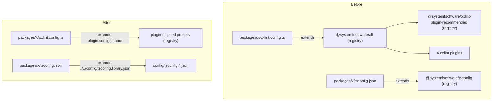

# Own Tool Configs - Plan

## Goal Capsule

- **Objective:** pnpm-release-management lints, typechecks, tests and builds exactly as strictly as it does today while depending on no systemfsoftware configuration package from outside its own tree; only plugin packages cross the repo boundary.
- **Means:** repo-owned TypeScript base files under `config/`, extended by relative path, replace `@systemfsoftware/tsconfig` (KTD1); each `oxlint.config.ts` extends the presets its plugins ship (`<plugin>.configs.<name>`) and adds only its own wiring, replacing `@systemfsoftware/all` (KTD2).
- **Product authority:** the conductor's config-ownership contract (2026-10-08) and the Unit C brief. Where they differ, the contract's definition of a config package wins over the brief's grep list (see Key Decisions).
- **Execution profile:** two independent PRs off `main`, neither stacked on the other (KTD6). The TypeScript PR goes now. The lint PR starts only after the systemfsoftware plugin presets are merged and distributed and the conductor sends go.
- **Stop conditions:** stop and report instead of proceeding when an equivalence diff shows a lost rule, a lowered severity or a removed/loosened compiler option that cannot be restored (in the owned TypeScript base, or by the plugin presets per KTD4); when the lockfile would gain a package R6 does not allow; or when CI cannot run the gate.
- **Who finishes:** `ce-work` implements and opens each PR; `ce-code-review` runs as its own step with findings reported unapplied; the conductor rules on findings and merges.
- **Open blockers:** the lint PR (U3, U4, U5) waits on plugin-shipped presets being distributed and the conductor's go (conductor ruling 08, 2026-10-09).

---

## Product Contract

Product Contract revision: conductor ruling 08 (2026-10-09) moved the shared lint rules from a repo-owned base into presets that plugins ship (Key Decisions, R3, R5, R6). The TypeScript contract is unchanged.

### Summary

The repo gains one internal, unpublished set of TypeScript bases under `config/` that every workspace member extends by relative path, and `@systemfsoftware/tsconfig` leaves the manifests and the lockfile. Each lint root stops extending the `@systemfsoftware/all` config package and instead extends the presets its oxlint plugins ship, plus its own overrides.

### Problem Frame

The org's internal tool configs were packaged and spread across repos, so a change to a shared preset silently changes this repo's lint and type rules, and the repo cannot state its own strictness without reading another repo's tarball. Here that takes three forms. Every tsconfig in the workspace (38 files) extends `@systemfsoftware/tsconfig`. Every `oxlint.config.ts` (18 lint roots) extends `@systemfsoftware/all`, an "extends-consumable" oxlint preset. That preset in turn spreads `@systemfsoftware/oxlint-plugin-recommended`, which despite its name holds no rules of its own: it is a config of built-in rules, plugin namespaces and test-file overrides. vitest, tsdown and stryker configs are already owned (no `vitest-config`, `tsdown-config` or `stryker-config` in any manifest or the lockfile), and this repo has no stryker config at all.

### Key Decisions

- **`@systemfsoftware/all` is a config package and leaves.** The contract defines a config package by shape ("extended / imported as tool configuration … any future package of that shape too"), not by name; `all` describes itself as a "complete oxlint preset". `@systemfsoftware/oxlint-plugin-recommended@1.1.5` as consumed today is a preset reached only through `all`, so it leaves with it. If the systemfsoftware unit ships the house preset as that package's `configs.<name>`, the repo consumes the new version as a plugin preset like any other. Governs R1.
- **Lint presets ship inside plugins; the repo never transcribes them.** session-settled: user-directed (conductor ruling 08, 2026-10-09). A named rule set, including the cross-plugin house style, is a plugin's `configs.<name>`, the flat-config convention. Each root's `oxlint.config.ts` extends or spreads those presets and adds only repo-specific wiring. Rejected: a repo-owned `config/oxlint.ts` copying `all` and `oxlint-plugin-recommended` (this plan's first revision), because 18 roots would then run a repo-local copy of org house style that drifts from the plugins owning the rules. Governs R3, R5.
- **One shared internal TypeScript base, not per-package copies.** The monorepo keeps one owned base per tsconfig preset, which the contract allows for a monorepo, rather than 38 inlined option sets. Lint has no repo-wide owned base: the shared rules come from plugin presets. Governs R2.

### Requirements

**Config ownership**

- R1. No manifest, lockfile importer or config file in the repo names `@systemfsoftware/tsconfig` or `@systemfsoftware/all`, and the lockfile resolves neither, nor the preset-only `@systemfsoftware/oxlint-plugin-recommended@1.1.5`.
- R2. The TypeScript options every project inherited (library-monorepo preset, node preset, bundler preset, Effect language-service policy) live in repo-owned base files that each tsconfig extends by relative path.
- R3. Every `oxlint.config.ts` extends (or spreads) plugin-shipped presets for what it inherited from `all` (plugin namespaces, type awareness, the correctness category, the defect tier, the test-file hygiene tier, the builtin-import ban, the fixtures exemption, the custom plugins and their recommended rules), and adds only its own per-root rules and overrides. No repo file restates the house preset.
- R4. The owned TypeScript bases sit outside every workspace package and are never packed, published or exported.

**Plugins**

- R5. The four custom oxlint plugins the preset loaded (`@systemfsoftware/oxlint-plugin`, `-cell-vocabulary`, `-effect-dmmf`, `-effect-entrypoint`) remain loaded, through the presets they ship, from the npm registry as today.
- R6. The TypeScript PR adds no package. The lint PR adds only the plugin versions that ship the presets, as named in the conductor's go.

**Equivalence**

- R7. For each of the 18 lint roots, `oxlint --print-config` after the change equals the output before, and the real lint run reports the same file count and rule count; any difference is listed and justified in the PR body, and none removes a rule or lowers a severity.
- R8. For each tsconfig project, `tsc --showConfig` (normalised with `jq -S`) after equals before; any difference is listed and justified, and none removes an option or loosens one.
- R9. vitest's collected test files per project are unchanged, recorded with `vitest list`.

**Delivery**

- R10. CI is green on each PR head, and its log shows lint, typecheck and test tasks executed rather than replayed from cache.
- R11. Docs that name a removed package as current practice point at the replacement instead (owned base or plugin preset); changelogs and finished plans stay as history.

### Acceptance Examples

- AE1. **Covers R7.** Given a root extends the plugin presets, when `oxlint --print-config` runs in `packages/version-engine` before and after, then the two `jq -S` outputs are byte-identical, and `oxlint . --format=default` reports the same "on N files with M rules" line. The rule count includes the custom-plugin rules that `--print-config` omits.
- AE3. **Covers R1, R6.** Given the TypeScript PR is applied, when the lockfile diff is read, then `packages:` loses `@systemfsoftware/tsconfig@1.3.3` and gains nothing.

### Scope Boundaries

- vitest, tsdown and stryker configs: already owned, nothing to move; evidence only (R9).
- Changing any rule, option or severity on purpose, including fixing violations a stricter rule would surface.
- The systemfsoftware monorepo's own config packages and their distribution.
- `@effect/tsgo` and `oxlint` version bumps.
- Shipping the presets inside plugins: the systemfsoftware unit's work; this repo only consumes them.

### Sources / Research

- `@systemfsoftware/all@1.1.3` `dist/index.mjs`: the preset object (`plugins`, `jsPlugins` resolved with `import.meta.resolve`, `options`, `categories`, `rules`, `overrides`); `ignorePatterns` is exported but not part of the default export.
- `@systemfsoftware/oxlint-plugin-recommended@1.1.5` `dist/index.mjs`: plugins `typescript, import, unicorn, vitest`, `typeAware: true`, 26 built-in rules, one test-file override.
- `@systemfsoftware/tsconfig@1.3.3`: `tsc/no-dom/library-monorepo.json`, `node.json`, `bundler/no-dom.json` (what `bundler/no-dom/library-monorepo` maps to), `effect.json`; the package has no dependencies, so no hidden tool pin.
- `docs/solutions/build-errors/deno-only-member-invisible-to-node-resolvers.md` and `docs/solutions/logic-errors/lint-gate-passes-while-linting-nothing.md` cite the `@systemfsoftware/all` preset.

---

## Planning Contract

### Key Technical Decisions

- KTD1. **Owned TypeScript bases live in a root `config/` directory.** `config/` is matched by no `pnpm-workspace.yaml` glob (`packages/*`, `apps/*`, `e2e`), so it has no manifest, is never packed by `pnpm pack` or `workspace-tarballs`, and no other repo can depend on it (R4). Files: `config/tsconfig.library.json` (was `tsc/no-dom/library-monorepo`), `config/tsconfig.node.json` (was `node`), `config/tsconfig.bundler.json` (was `bundler/no-dom`), `config/tsconfig.effect.json` (was `effect`, comments kept). Only the presets the repo uses are copied; the package's unused `dom`/`app`/`library` variants are not.
- KTD2. **Each lint root extends plugin presets plus its own wiring.** `oxlint.config.ts` becomes `extends: [<plugin>.configs.<name>, …]` (or a spread where object composition is needed), followed by the root's existing `rules` and `overrides`, unchanged. Which presets, and their names, come from the systemfsoftware plugin release named in the go.
- KTD3. **The presets carry their own plugin wiring.** oxlint resolves relative `jsPlugins` in an extended object against the extending config, not the preset (oxc issue 18863); `all` handled that with `import.meta.resolve` from its own module. At go, check that the shipped presets do the same, so a root needs no `jsPlugins` of its own; if they do not, report it to the conductor as a preset defect rather than wiring paths in 18 roots.
- KTD4. **Equivalence target is today's merged rule map.** The presets must compose, in each root, to the rule map `all` produced (R7). A rule lost or a severity lowered by the presets is a stop condition reported to the conductor, not something patched into the roots; only genuinely repo-specific wiring belongs in a root.
- KTD6. **Two independent PRs off `main`.** The TypeScript PR (`chore/own-configs`, at `main` 21fe619) owns tsconfig and carries this plan. The lint PR (`chore/own-oxlint-config`) needs nothing from it (no `config/` file), so neither stacks on the other (conductor ruling 08). Both edit the root `package.json` and `pnpm-lock.yaml`; whichever lands second merges `main` and regenerates the lockfile. The overlap check against open PR #28 (`prm/pnpm-versionless-root`) found no shared file.
- KTD7. **Turbo inputs name the owned bases.** Package task inputs (`$TURBO_DEFAULT$`) cover only the package directory, so an edit under `config/` would otherwise replay stale `lint`, `typecheck`, `build` and `test` results. `turbo.json` adds `$TURBO_ROOT$/config/**` to those four tasks and `config/**` to `//#typecheck:node`. `lint` is included because type-aware rules read the tsconfig; `test` because vite reads tsconfig compiler options during transform.
- KTD8. **Intent records are `none` changesets.** Every publishable package whose files change gets `none` in one changeset per PR, matching `.changeset/tsgo-0.50.md`. The list per PR is whatever `changeset-management check` reports; the 13 non-private packages are expected in both.

### High-Level Technical Design

Before and after, for one package (directional; the same shape holds for all 18 roots and 38 tsconfigs).

### Assumptions

These are bets not confirmed with the conductor; each is checked during execution.

- Removing the `@systemfsoftware/tsconfig` devDependency changes only importers and drops that one `packages:` entry; no other resolution moves (AE3).
- `tsc --showConfig` output does not embed the `extends` chain, so moving a preset from a package to `config/` leaves it byte-identical after `jq -S`. A difference in any path-valued field is reported, not hidden.
- `vitest list` can enumerate the e2e project without starting containers. If it cannot, R9's e2e row is recorded from `e2e/vitest.config.ts` being byte-identical and stated as such.
- `@effect/tsgo` 0.50.0 (root) reads the copied Effect policy exactly as before, since `@systemfsoftware/tsconfig` pins no tool version.

### Sequencing

1. Capture baselines on `main` (21fe619) before any edit.
2. TypeScript PR off `main`: U1, U2. Evidence, CI green, PR. Goes now.
3. Lint PR off `main`, independent: U3, U4, U5, after the conductor's go. Baselines are re-captured on the `main` it branches from.

---

## Implementation Units

### U1. Own the TypeScript bases

- **Goal:** every tsconfig extends a repo-owned base by relative path, and `@systemfsoftware/tsconfig` leaves the repo.
- **Requirements:** R1, R2, R4, R6, R8.
- **Dependencies:** baseline capture (Sequencing step 1).
- **Files:**
  - create `config/tsconfig.library.json`, `config/tsconfig.node.json`, `config/tsconfig.bundler.json`, `config/tsconfig.effect.json`
  - modify `tsconfig.json`, `tsconfig.node.json`
  - modify `tsconfig.json` and `tsconfig.node.json` in each of `apps/{changeset-management,git-hooks,github-release-management,version-management}`, `e2e`, `packages/{adoption-adapter,changeset-engine,changesets-adapter,cli-adapter,git-adapter,git-hooks-engine,github-adapter,github-release-engine,process-adapter,release-language,tarball-adapter,version-engine,workspace-adapter}`
  - modify `package.json` and every member `package.json` listed above (drop the `@systemfsoftware/tsconfig` devDependency)
  - modify `pnpm-lock.yaml`
  - create `.changeset/own-tsconfig.md`
- **Approach:**
  1. Copy each used preset byte-for-byte from `@systemfsoftware/tsconfig@1.3.3` into its `config/` file (KTD1).
  2. Repoint `extends`: members use `../../config/tsconfig.library.json` and `../../config/tsconfig.node.json` (`e2e` uses `../config/…`); root `tsconfig.json` extends `./config/tsconfig.bundler.json` and `./config/tsconfig.effect.json` in the same order as today.
  3. Remove the devDependency everywhere and regenerate the lockfile with `pnpm install`.
  4. Write the `none` changeset (KTD8).
- **Patterns to follow:** `.changeset/tsgo-0.50.md` for the intent file; existing per-package `compilerOptions` stay untouched.
- **Test scenarios:** Test expectation: none -- configuration move with no behavioral change; equivalence is proven by `tsc --showConfig` diffs and the gate (Verification Contract), and the contract forbids committed evidence scripts.
- **Verification:** all 38 `--showConfig` outputs pass the tsc equivalence gate (Verification Contract); lockfile `packages:` lost `@systemfsoftware/tsconfig@1.3.3` and gained nothing; CI's `pnpm check:ci` green.

### U2. Name the owned bases in turbo inputs

- **Goal:** an edit under `config/` invalidates every cached task that reads it.
- **Requirements:** R10.
- **Dependencies:** U1.
- **Files:** modify `turbo.json`.
- **Approach:** add the inputs from KTD7 to `build`, `typecheck`, `lint`, `test` and `//#typecheck:node`; change nothing else in those tasks.
- **Patterns to follow:** the existing `$TURBO_ROOT$/vitest.fast-check.setup.ts` entry in `test.inputs`.
- **Test scenarios:** Test expectation: none -- cache-key configuration; checked by the turbo dry run below.
- **Verification:** `turbo run lint --dry=json` lists a `config/` file among each package task's inputs; touching `config/tsconfig.library.json` turns a cached `lint` run into a cache miss.

### U3. Depend on the preset-shipping plugins and drop `all`

- **Goal:** the plugin versions that ship the presets become root devDependencies, and `@systemfsoftware/all` and `@systemfsoftware/oxlint-plugin-recommended@1.1.5` leave the lockfile.
- **Requirements:** R1, R5, R6.
- **Dependencies:** conductor's go (Open blockers). Independent of U1 and U2.
- **Files:** modify `package.json`, `pnpm-lock.yaml`.
- **Approach:** remove `@systemfsoftware/all`; add each plugin whose presets a root extends, at the version named in the go; regenerate the lockfile.
- **Test scenarios:** Test expectation: none -- dependency swap; proven by the lockfile gate.
- **Verification:** lockfile `packages:` lost `@systemfsoftware/all@1.1.3` and `@systemfsoftware/oxlint-plugin-recommended@1.1.5`; every added entry is a plugin version named in the go.

### U4. Point the 18 lint roots at plugin presets

- **Goal:** every `oxlint.config.ts` extends plugin presets plus its own wiring, with lint output equal to the baseline.
- **Requirements:** R3, R7 (AE1).
- **Dependencies:** U3.
- **Files:**
  - modify `oxlint.config.ts` in `apps/{changeset-management,git-hooks,github-release-management,version-management}`, `e2e`, and all 13 `packages/*`
  - create `.changeset/own-oxlint-config.md`
- **Approach:**
  1. Replace `import all from '@systemfsoftware/all'` and `extends: [all]` with the plugin preset imports and `extends` (KTD2); per-root `rules` and `overrides` stay byte-identical.
  2. Write the `none` changeset (KTD8).
- **Execution note:** run the negative controls (Verification Contract) on a scratch copy before trusting a green lint; revert the scratch edits and commit none of them.
- **Patterns to follow:** existing member `oxlint.config.ts` files.
- **Test scenarios:** Test expectation: none -- lint configuration; proven by per-root `--print-config` diffs, lint summaries and negative controls.
- **Verification:** AE1 holds for all 18 roots.

### U5. Point the solution docs at the plugin preset

- **Goal:** no doc presents a removed package as current practice.
- **Requirements:** R11.
- **Dependencies:** U3.
- **Files:** modify `docs/solutions/logic-errors/lint-gate-passes-while-linting-nothing.md`, `docs/solutions/build-errors/deno-only-member-invisible-to-node-resolvers.md`.
- **Approach:** replace "the `@systemfsoftware/all` preset states/documents this" with the plugin preset that now carries that statement, quoting it only if the shipped preset keeps it.
- **Test scenarios:** Test expectation: none -- documentation.
- **Verification:** the DEL1 grep (Verification Contract) returns hits only in `docs/plans/` history.

---

## Verification Contract

Baselines come from a scratch checkout of the `main` each PR branches from (21fe619 for the TypeScript PR), outside the repo tree (for example a `git worktree` under `/tmp`), installed with `pnpm install --frozen-lockfile`. Nothing used for evidence is committed. Lint runs use `--format=default`, since the `AGENT` variable otherwise selects a format with no summary line.

| Gate                            | Command (run from the repo root unless noted)                                                                                                                    | PR       | Pass signal                                                                                          |
| ------------------------------- | ---------------------------------------------------------------------------------------------------------------------------------------------------------------- | -------- | ---------------------------------------------------------------------------------------------------- |
| Install                         | `pnpm install --frozen-lockfile`                                                                                                                                 | TS, lint | exit 0                                                                                               |
| Repo gate                       | `pnpm check:ci`, run by CI only (never locally)                                                                                                                  | TS, lint | exit 0 (format, lint, typecheck, typecheck:node, test, build)                                        |
| tsc equivalence                 | per tsconfig file `f` (38): `pnpm exec tsc -p f --showConfig \| jq -S .`, diffed against baseline                                                                | TS, lint | identical, or each difference listed and justified with no option removed or loosened (R8)           |
| oxlint equivalence              | in each of the 18 roots: `pnpm exec oxlint --print-config \| jq -S .`, diffed against baseline                                                                   | TS, lint | identical, or each difference listed and justified with no rule removed and no severity lowered (R7) |
| oxlint run                      | in each root: `pnpm exec oxlint . --format=default`, summary line                                                                                                | TS, lint | same file and rule count as baseline                                                                 |
| vitest                          | `pnpm exec vitest list --filesOnly --json` in the root and each of the 15 member projects with a `vitest.config.ts`                                              | TS, lint | identical file lists (see Assumptions for e2e)                                                       |
| Negative control, built-in rule | scratch `import 'node:fs'` in a `packages/*/src` file, run that root's lint                                                                                      | TS, lint | non-zero, `no-restricted-imports`                                                                    |
| Negative control, custom plugin | scratch violation of one rule from `@systemfsoftware/oxlint-plugin-effect-entrypoint`'s recommended set                                                          | TS, lint | non-zero, that rule id                                                                               |
| Negative control, type-aware    | scratch un-awaited promise in a `src` file                                                                                                                       | TS, lint | non-zero, `typescript/no-floating-promises`                                                          |
| Lockfile                        | `git diff main -- pnpm-lock.yaml`, `packages:` section                                                                                                           | TS, lint | TS: AE3; lint: U3's verification                                                                     |
| Removal (DEL1)                  | `git grep -nI -e '<removed package>' -- . ':!*.lock'`: `@systemfsoftware/tsconfig` (TS); `@systemfsoftware/all`, `oxlint-plugin-recommended@1.1.5` (lint)        | TS, lint | hits only in `docs/plans/` history and CHANGELOGs                                                    |
| Predicate                       | `git grep -nE 'oxlint-config-(recommended\|cell-architecture\|dmmf\|rule-authoring)\|@systemfsoftware/(vitest-config\|tsconfig\|tsdown-config\|stryker-config)'` | TS, lint | hits only in `docs/plans/` and CHANGELOG history, each listed and classified in the PR body          |
| Changesets                      | `changeset-management check <base-sha>` (built from `apps/changeset-management`)                                                                                 | TS, lint | exit 0                                                                                               |
| CI                              | `ci.yml` and `changeset-check.yml` on each PR head                                                                                                               | TS, lint | green; turbo log shows `lint`, `typecheck`, `test` as cache misses                                   |

No permanent test is added: test-layer selection admits none, because no behavior changes and the contract bars committed evidence scripts. Mutation testing is not run locally.

---

## Definition of Done

- Two independent PRs are open off `main` (TypeScript now, lint after the conductor's go), each green in CI on its head SHA, with head SHAs reported.
- Each PR body records: the equivalence tables for its tool (per root or per project, identical or each difference justified); the lint summary lines before and after; the lockfile `packages:` changes; the predicate-grep hits with their classification (this plan in `docs/plans/` is history once finished); the CI evidence that tasks executed.
- R1–R11 hold once both PRs are merged; the TypeScript PR alone satisfies R1 for `@systemfsoftware/tsconfig`, R2, R4, R8 and R9.
- No scratch edits from negative controls, baseline worktrees or `.bak` copies remain in the diff.
- `ce-code-review` has run as its own step with findings reported unapplied.
