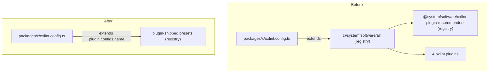

# Own Oxlint Config - Plan

## Goal Capsule

- **Objective:** pnpm-release-management lints exactly as strictly as it does today without extending the `@systemfsoftware/all` oxlint config package; lint rules reach the repo only through presets that plugins ship.
- **Means:** each `oxlint.config.ts` extends the presets its plugins ship (`<plugin>.configs.<name>`) and adds only its own wiring (KTD2).
- **Product authority:** the conductor's config-ownership contract (2026-10-08), the Unit C brief, conductor ruling 08 (lint presets ship inside plugins) and conductor ruling 15 (`@systemfsoftware/tsconfig` is a shared base package and stays). Where the contract and the brief differ, the contract's definition of a config package wins over the brief's grep list (see Key Decisions).
- **Execution profile:** one lint PR off `main`. It starts only after the systemfsoftware plugin presets are merged and distributed and the conductor sends go.
- **Stop conditions:** stop and report instead of proceeding when an equivalence diff shows a lost rule or a lowered severity that the plugin presets cannot restore (KTD4); when the lockfile would gain a package R6 does not allow; or when CI cannot run the gate.
- **Who finishes:** `ce-work` implements and opens the PR; `ce-code-review` runs as its own step with findings reported unapplied; the conductor rules on findings and merges.
- **Open blockers:** the lint PR (U3, U4, U5) waits on plugin-shipped presets being distributed and the conductor's go (conductor ruling 08, 2026-10-09).

---

## Product Contract

Product Contract revision: conductor ruling 15 (2026-10-09) struck the TypeScript half of this plan. `@systemfsoftware/tsconfig` is a shared base package; the repo keeps extending it, and PR #50, which had moved its bases into `config/`, is reverted. R2, R4, R8, AE3, KTD1, KTD7, U1 and U2 belonged to that half and are retired; the remaining IDs keep their numbers.

### Summary

Each lint root stops extending the `@systemfsoftware/all` config package and instead extends the presets its oxlint plugins ship, plus its own overrides.

### Problem Frame

The org's internal lint config was packaged and spread across repos, so a change to the shared preset silently changes this repo's lint rules, and the repo cannot state its own strictness without reading another repo's tarball. Every `oxlint.config.ts` (18 lint roots) extends `@systemfsoftware/all`, an "extends-consumable" oxlint preset. That preset in turn spreads `@systemfsoftware/oxlint-plugin-recommended`, which despite its name holds no rules of its own: it is a config of built-in rules, plugin namespaces and test-file overrides. vitest, tsdown and stryker configs are already owned (no `vitest-config`, `tsdown-config` or `stryker-config` in any manifest or the lockfile), and this repo has no stryker config at all.

### Key Decisions

- **`@systemfsoftware/tsconfig` stays a shared base.** session-settled: user-directed (conductor ruling 15, 2026-10-09). Every tsconfig keeps extending the package. Rejected: repo-owned bases under `config/` extended by relative path (PR #50, reverted), because the TypeScript base is meant to be shared across repos. Governs R1.
- **`@systemfsoftware/all` is a config package and leaves.** The contract defines a config package by shape ("extended / imported as tool configuration … any future package of that shape too"), not by name; `all` describes itself as a "complete oxlint preset". `@systemfsoftware/oxlint-plugin-recommended@1.1.5` as consumed today is a preset reached only through `all`, so it leaves with it. If the systemfsoftware unit ships the house preset as that package's `configs.<name>`, the repo consumes the new version as a plugin preset like any other. Governs R1.
- **Lint presets ship inside plugins; the repo never transcribes them.** session-settled: user-directed (conductor ruling 08, 2026-10-09). A named rule set, including the cross-plugin house style, is a plugin's `configs.<name>`, the flat-config convention. Each root's `oxlint.config.ts` extends or spreads those presets and adds only repo-specific wiring. Rejected: a repo-owned `config/oxlint.ts` copying `all` and `oxlint-plugin-recommended`, because 18 roots would then run a repo-local copy of org house style that drifts from the plugins owning the rules. Governs R3, R5.

### Requirements

**Config ownership**

- R1. No manifest, lockfile importer or config file in the repo names `@systemfsoftware/all`, and the lockfile resolves neither it nor the preset-only `@systemfsoftware/oxlint-plugin-recommended@1.1.5`. `@systemfsoftware/tsconfig` is out of scope (Key Decisions).
- R3. Every `oxlint.config.ts` extends (or spreads) plugin-shipped presets for what it inherited from `all` (plugin namespaces, type awareness, the correctness category, the defect tier, the test-file hygiene tier, the builtin-import ban, the fixtures exemption, the custom plugins and their recommended rules), and adds only its own per-root rules and overrides. No repo file restates the house preset.

**Plugins**

- R5. The four custom oxlint plugins the preset loaded (`@systemfsoftware/oxlint-plugin`, `-cell-vocabulary`, `-effect-dmmf`, `-effect-entrypoint`) remain loaded, through the presets they ship, from the npm registry as today.
- R6. The lint PR adds only the plugin versions that ship the presets, as named in the conductor's go.

**Equivalence**

- R7. For each of the 18 lint roots, `oxlint --print-config` after the change equals the output before, and the real lint run reports the same file count and rule count; any difference is listed and justified in the PR body, and none removes a rule or lowers a severity.
- R9. vitest's collected test files per project are unchanged, recorded with `vitest list`.

**Delivery**

- R10. CI is green on the PR head, and its log shows lint, typecheck and test tasks executed rather than replayed from cache.
- R11. Docs that name a removed package as current practice point at the plugin preset instead; changelogs and finished plans stay as history.

### Acceptance Examples

- AE1. **Covers R7.** Given a root extends the plugin presets, when `oxlint --print-config` runs in `packages/version-engine` before and after, then the two `jq -S` outputs are byte-identical, and `oxlint . --format=default` reports the same "on N files with M rules" line. The rule count includes the custom-plugin rules that `--print-config` omits.

### Scope Boundaries

- TypeScript configuration: every tsconfig keeps extending `@systemfsoftware/tsconfig` (conductor ruling 15).
- vitest, tsdown and stryker configs: already owned, nothing to move; evidence only (R9).
- Changing any rule or severity on purpose, including fixing violations a stricter rule would surface.
- The systemfsoftware monorepo's own config packages and their distribution.
- `@effect/tsgo` and `oxlint` version bumps.
- Shipping the presets inside plugins: the systemfsoftware unit's work; this repo only consumes them.

### Sources / Research

- `@systemfsoftware/all@1.1.3` `dist/index.mjs`: the preset object (`plugins`, `jsPlugins` resolved with `import.meta.resolve`, `options`, `categories`, `rules`, `overrides`); `ignorePatterns` is exported but not part of the default export.
- `@systemfsoftware/oxlint-plugin-recommended@1.1.5` `dist/index.mjs`: plugins `typescript, import, unicorn, vitest`, `typeAware: true`, 26 built-in rules, one test-file override.
- `docs/solutions/build-errors/deno-only-member-invisible-to-node-resolvers.md` and `docs/solutions/logic-errors/lint-gate-passes-while-linting-nothing.md` cite the `@systemfsoftware/all` preset.

---

## Planning Contract

### Key Technical Decisions

- KTD2. **Each lint root extends plugin presets plus its own wiring.** `oxlint.config.ts` becomes `extends: [<plugin>.configs.<name>, …]` (or a spread where object composition is needed), followed by the root's existing `rules` and `overrides`, unchanged. Which presets, and their names, come from the systemfsoftware plugin release named in the go.
- KTD3. **The presets carry their own plugin wiring.** oxlint resolves relative `jsPlugins` in an extended object against the extending config, not the preset (oxc issue 18863); `all` handled that with `import.meta.resolve` from its own module. At go, check that the shipped presets do the same, so a root needs no `jsPlugins` of its own; if they do not, report it to the conductor as a preset defect rather than wiring paths in 18 roots.
- KTD4. **Equivalence target is today's merged rule map.** The presets must compose, in each root, to the rule map `all` produced (R7). A rule lost or a severity lowered by the presets is a stop condition reported to the conductor, not something patched into the roots; only genuinely repo-specific wiring belongs in a root.
- KTD6. **One PR off `main`.** The lint PR (`chore/own-oxlint-config`) branches from `main` at go and stacks on nothing. Before push it runs the overlap check against every open PR.
- KTD8. **Intent records are `none` changesets, only when the gate asks.** If `changeset-management check` reports a publishable package without an intent, add one `none` changeset naming the packages it reports, matching `.changeset/tsgo-0.50.md`.

### High-Level Technical Design

Before and after, for one package (directional; the same shape holds for all 18 roots).

### Assumptions

These are bets not confirmed with the conductor; each is checked during execution.

- `vitest list` can enumerate the e2e project without starting containers. If it cannot, R9's e2e row is recorded from `e2e/vitest.config.ts` being byte-identical and stated as such.

### Sequencing

1. After the conductor's go, capture baselines on the `main` the lint PR branches from, before any edit.
2. Lint PR off `main`: U3, U4, U5. Evidence, CI green, PR.

---

## Implementation Units

### U3. Depend on the preset-shipping plugins and drop `all`

- **Goal:** the plugin versions that ship the presets become root devDependencies, and `@systemfsoftware/all` and `@systemfsoftware/oxlint-plugin-recommended@1.1.5` leave the lockfile.
- **Requirements:** R1, R5, R6.
- **Dependencies:** conductor's go (Open blockers).
- **Files:** modify `package.json`, `pnpm-lock.yaml`.
- **Approach:** remove `@systemfsoftware/all`; add each plugin whose presets a root extends, at the version named in the go; regenerate the lockfile.
- **Test scenarios:** Test expectation: none -- dependency swap; proven by the lockfile gate.
- **Verification:** lockfile `packages:` lost `@systemfsoftware/all@1.1.3` and `@systemfsoftware/oxlint-plugin-recommended@1.1.5`; every added entry is a plugin version named in the go.

### U4. Point the 18 lint roots at plugin presets

- **Goal:** every `oxlint.config.ts` extends plugin presets plus its own wiring, with lint output equal to the baseline.
- **Requirements:** R3, R7 (AE1).
- **Dependencies:** U3.
- **Files:**
  - modify `oxlint.config.ts` in `apps/{changeset-management,git-hooks,github-release-management,version-management}`, `e2e`, and all 13 `packages/*`
  - create a `none` changeset if KTD8 applies
- **Approach:**
  1. Replace `import all from '@systemfsoftware/all'` and `extends: [all]` with the plugin preset imports and `extends` (KTD2); per-root `rules` and `overrides` stay byte-identical.
  2. Run the changeset gate and write the `none` changeset if it asks (KTD8).
- **Execution note:** run the negative controls (Verification Contract) on a scratch copy before trusting a green lint; revert the scratch edits and commit none of them.
- **Patterns to follow:** existing member `oxlint.config.ts` files.
- **Test scenarios:** Test expectation: none -- lint configuration; proven by per-root `--print-config` diffs, lint summaries and negative controls.
- **Verification:** AE1 holds for all 18 roots.

### U5. Point the solution docs at the plugin preset

- **Goal:** no doc presents a removed package as current practice.
- **Requirements:** R11.
- **Dependencies:** U3.
- **Files:** modify `docs/solutions/logic-errors/lint-gate-passes-while-linting-nothing.md`, `docs/solutions/build-errors/deno-only-member-invisible-to-node-resolvers.md`.
- **Approach:** replace "the `@systemfsoftware/all` preset states/documents this" with the plugin preset that now carries that statement, quoting it only if the shipped preset keeps it.
- **Test scenarios:** Test expectation: none -- documentation.
- **Verification:** the DEL1 grep (Verification Contract) returns hits only in `docs/plans/` history.

---

## Verification Contract

Baselines come from a scratch checkout of the `main` the lint PR branches from, outside the repo tree (for example a `git worktree` under `/tmp`), installed with `pnpm install --frozen-lockfile`. Nothing used for evidence is committed. Lint runs use `--format=default`, since the `AGENT` variable otherwise selects a format with no summary line.

| Gate                            | Command (run from the repo root unless noted)                                                                                                          | Pass signal                                                                                             |
| ------------------------------- | ------------------------------------------------------------------------------------------------------------------------------------------------------ | ------------------------------------------------------------------------------------------------------- |
| Install                         | `pnpm install --frozen-lockfile`                                                                                                                       | exit 0                                                                                                  |
| Repo gate                       | `pnpm check:ci`, run by CI only (never locally)                                                                                                        | exit 0 (format, lint, typecheck, typecheck:node, test, build)                                           |
| oxlint equivalence              | in each of the 18 roots: `pnpm exec oxlint --print-config \| jq -S .`, diffed against baseline                                                         | identical, or each difference listed and justified with no rule removed and no severity lowered (R7)    |
| oxlint run                      | in each root: `pnpm exec oxlint . --format=default`, summary line                                                                                      | same file and rule count as baseline                                                                    |
| vitest                          | `pnpm exec vitest list --filesOnly --json` in the root and each of the 15 member projects with a `vitest.config.ts`                                    | identical file lists (see Assumptions for e2e)                                                          |
| Negative control, built-in rule | scratch `import 'node:fs'` in a `packages/*/src` file, run that root's lint                                                                            | non-zero, `no-restricted-imports`                                                                       |
| Negative control, custom plugin | scratch violation of one rule from `@systemfsoftware/oxlint-plugin-effect-entrypoint`'s recommended set                                                | non-zero, that rule id                                                                                  |
| Negative control, type-aware    | scratch un-awaited promise in a `src` file                                                                                                             | non-zero, `typescript/no-floating-promises`                                                             |
| Lockfile                        | `git diff main -- pnpm-lock.yaml`, `packages:` section                                                                                                 | U3's verification                                                                                       |
| Removal (DEL1)                  | `git grep -nI -e '@systemfsoftware/all' -e 'oxlint-plugin-recommended@1.1.5' -- . ':!*.lock'`                                                          | hits only in `docs/plans/` history and CHANGELOGs                                                       |
| Predicate                       | `git grep -nE 'oxlint-config-(recommended\|cell-architecture\|dmmf\|rule-authoring)\|@systemfsoftware/(vitest-config\|tsdown-config\|stryker-config)'` | hits only in `docs/plans/` and CHANGELOG history, each listed and classified in the PR body             |
| Changesets                      | `changeset-management check <base-sha>` (built from `apps/changeset-management`)                                                                       | exit 0                                                                                                  |
| CI                              | `ci.yml`, `changeset-check.yml`, `e2e.yml` and `sandbox.yml` on the PR head                                                                            | green; turbo log shows `lint`, `typecheck`, `test` as cache misses; E2E image builds and Sandbox passes |

No permanent test is added: test-layer selection admits none, because no behavior changes and the contract bars committed evidence scripts. Mutation testing is not run locally.

---

## Definition of Done

- One lint PR is open off `main`, green in CI on its head SHA, with the head SHA reported.
- The PR body records: the per-root oxlint equivalence table (identical, or each difference justified); the lint summary lines before and after; the lockfile `packages:` changes; the predicate-grep hits with their classification (this plan in `docs/plans/` is history once finished); the CI evidence that tasks executed.
- R1, R3, R5, R6, R7, R9, R10 and R11 hold once the PR is merged.
- No scratch edits from negative controls, baseline worktrees or `.bak` copies remain in the diff.
- `ce-code-review` has run as its own step with findings reported unapplied.
